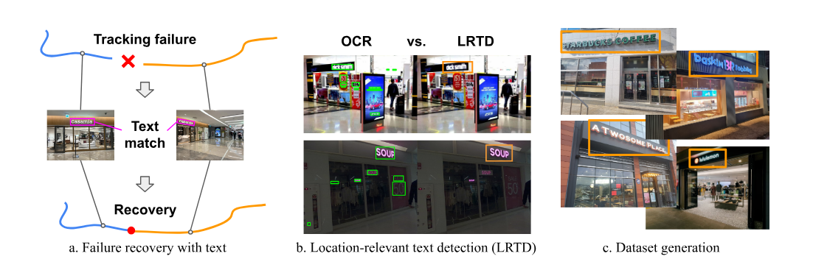
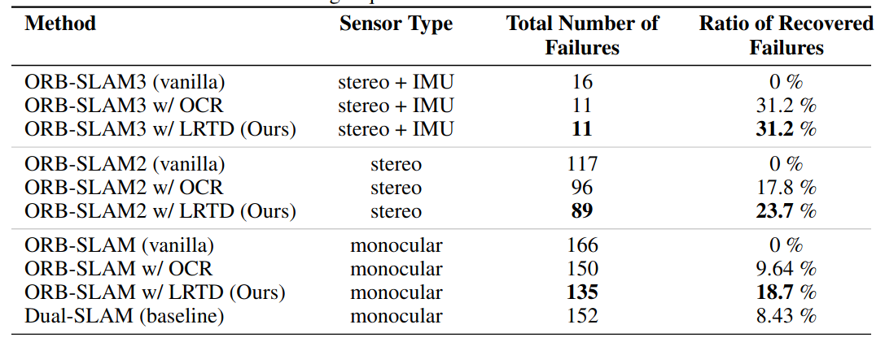
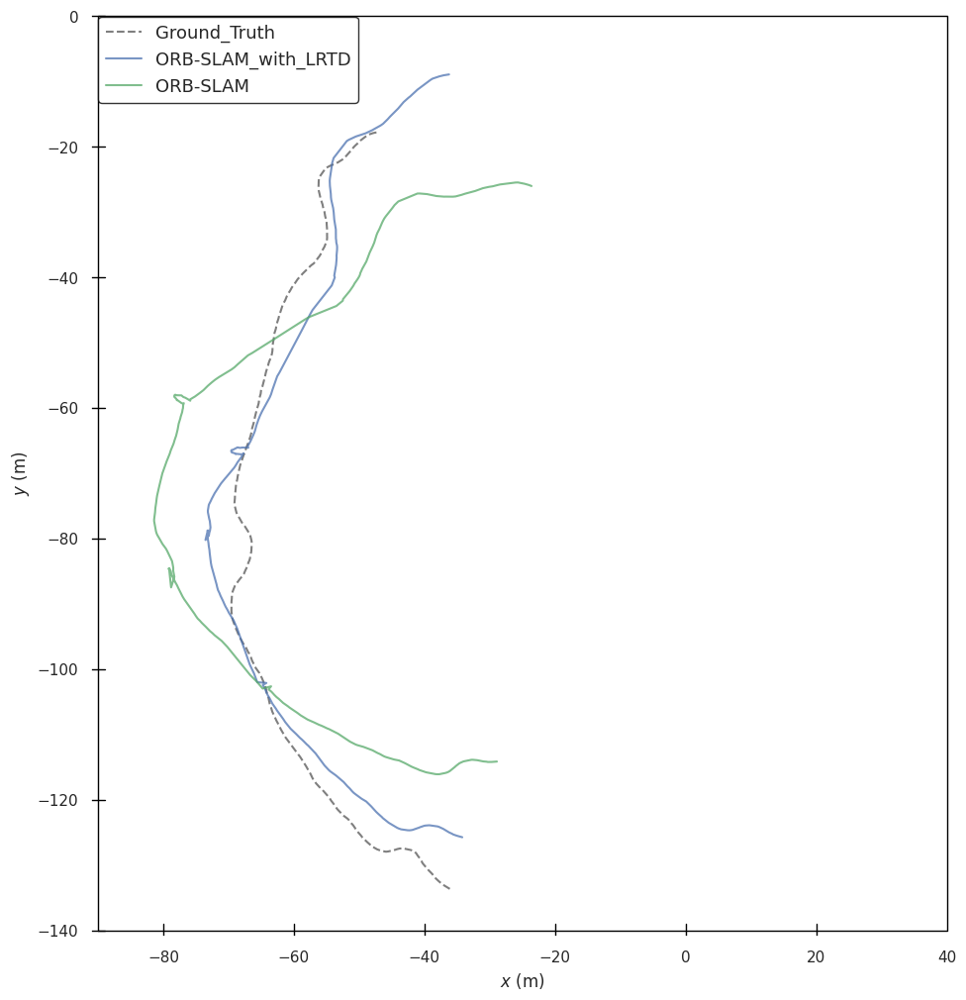

# Recovery from Tracking Failure with Location-Relevant Text Detection for Indoor Visual SLAM

## Overview

### Motivation
Camera pose tracking failure is a critical issue in visual SLAM systems.\ 
Although various failure recovery methods have been proposed, they often struggle when the number of shared features before and after the failure is insufficient.\
In this work, we propose an approach for robust failure recovery that leverages text detection to enhance the reliability of feature matching.

### Method



We propose failure recovery leveraging Location-Relevant Text Detection(LRTD).

(a) Failure recovery is achieved by utilizing text detection.\
(b) LRTD filters out irrelevant text, enhancing robustness and computational efficiency.\
(c) A dataset generation pipeline is designed to automatically create training data for LRTD.

### LRTD


This is a demo of our main model, Location-Relevant Text Detection(LRTD).\
LRTD is designed to take an image as input and output the bounding boxes of location-relevant text segments in a scene.

## Results

### Evaluation



This is our experiment result across different SLAM methods.\
We observed a remarkable reduction in the number of failures across all three types of SLAM systems.

### Visualized result



This represents a simple example of trajectory comparison between our proposed method and ORB-SLAM.


## Contributors

<!-- ALL-CONTRIBUTORS-LIST:START - Do not remove or modify this section -->
<!-- prettier-ignore-start -->
<!-- markdownlint-disable -->
<table>
  <tr>
    <td align="center"><a href="https://github.com/exceldra5"><br /><sub><b>Sooyong Shin</b></sub></a><br /><a href="https://github.com/exceldra5" title="Code"></a></td>
    <td align="center"><a href="https://github.com/jdudttjs"><br /><sub><b>Youngsun Jae</b></sub></a><br /><a href="https://github.com/jdudttjs" title="Code"></a></td>
    <td align="center"><a href="https://github.com/darthegg"><br /><sub><b>Chaehyeuk Lee</b></sub></a><br /><a href="https://github.com/darthegg" title="Code"></a></td>
  </tr>
</table>

<!-- markdownlint-restore -->
<!-- prettier-ignore-end -->

<!-- ALL-CONTRIBUTORS-LIST:END -->

## How to run

### 1. Install Dependencies
This project requires Python 3.10+
```bash
pip install -r requirements.txt
```
### 2. Download Sample Dataset
Due to size limits, sample data is hosted externally.\
Make sure to create the 'data/' and 'results/' directory in this step.

```bash
mkdir data && cd data
gdown https://drive.google.com/uc?id=1tZsYiypBhw_9EdzqTGKThjxZBzSjsgU7
unzip example_sequence.zip 
cd .. && mkdir results
```

### 3. Set the Working Directory
In 'env.sh', set the path below to the absolute path of your code directory.
```bash
RUN_DIR="absolute/path/to/your/code"
```

### 4. Run the Full Pipeline
The command below runs the full pipeline of our system.\
This pipeline requires a CUDA-compatible GPU.
```bash
bash run_all_pipeline.sh
```
Will sequentially execute:

- src/runLRTD - Perform LRTD on all keyframes

- src/search4frames - Text guided frame search & Local map generation

- src/alignmaps - Align two maps with local map 

- evo_traj - Visualize trajectory comparision between our method and ORB-SLAM

## Input format
All inputs should be stored in:
```bash
data/your_sequence_name
```
Should contain:

- images/ - RGB images of keyframes

- orb_result/KeyframeTrakectoryXX.txt - Trajectories of built maps

- orb_result/timestamp.txt - Timestamps of relocalization & tracking fail

- Ground_Truth.txt - Ground truth trajectory 

- ORB-SLAM.txt - Aligned trajectory without LRTD
 
## Output format
All outputs will be stored in:
```bash
results/your_sequence_name
```
Should contain:

- COLMAP/

- LRTD_images/ 

- log_4images.txt 

- log_colmap.txt 

- log_tracking_fail.txt 

- LRTD_filtered_info.csv 

- LRTD_info.csv 

- ORB-SLAM_with_LRTD.txt - Aligned trajectory with LRTD

## Configuration
You can configure:

- Frame search hyperparameters (in 'src/search4frames/config.yaml')

- Data and result paths (in 'env.sh')
